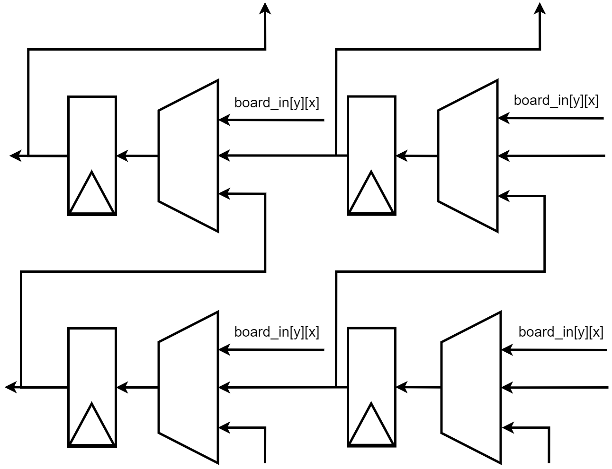

# FPGA Minimax Engine: Connect Four

## Introduction & Conclusion
Inspired by a project in my intro to computer science course, I wrote a Connect 4 minimax engine in Verilog that I pinned against the Java monstrosity I created during my freshman year of university. This project was designed for the Xilinx Zynq XC7Z020 FPGA & ARM SoC, but given its low resource usage, it is easily able to fit on any Zynq device. In Java I was able to achieve a minimax search depth of about 5-6 while maintaining an average AI computation time of about 500 ms, but in hardware I was able to achieve a search depth 8. With some algorthmic tweaks, I was able to achieve a search depth of 10, a 2401 times performance improvement compared to a depth of 6. 

<p align="center">  </p>

## Hardware Description
### Algorithm: Minimax

The base algorithm is minimax, a classic algorithm for determining an optimal move in games with discrete moves where both players are assumed to play optimally. The algorithm is essentially a tree search, where each node in the tree represents a game state (the board). The algorithm needs a method of determining the desirability of each board, as it will try to maximize this value over the course of a game. Winning should correspond maximum score, and losing should correspond the minimum score. The scoring function should trend towards the maximum score as the player gets closer to winning, and should trend towards the minimum score as the player gets closer to losing. A common implementation of this algorithm is a recursive depth first search with some limitation on the maximum search depth, as depicted below:
```python
def minimax(board, depth, depth_limit, player):
    score, terminal = calc_score(board)
    
    if (depth == depth_limit or terminal):
        return score
    
    best_child_id = -1
    best_child_score = 0       
    for child_id in range(0, 7):
        # update_board(board_in, player, move_column)
        new_board = update_board(board, player, child_id)
        child_score = minimax( new_board, depth+1, depth_limit, !player)
        
        if player == 1: # we, the AI, want the highest score
            if best_child_id == -1 or child_score > best_child_score:
                best_child_id = child_id
                best_child_score = child_score
        else: # we, the the opponent, want the lowest score
            if best_child_id == -1 or child_score < best_child_score:
                best_child_id = child_id
                best_child_score = child_score
        
```

### Algorithm: Minimax w/ Alpha Beta Pruning

Alpha-beta pruning is a technique that can drastically decrease the number of nodes that need to be searched by minimax while still returning the optimal result. [This site](https://www.javatpoint.com/ai-alpha-beta-pruning) does a great job of summarizing the optimization, but I will summarize briefly here. At each node we keep track of two new values, alpha and beta. Alpha represents the highest score that the maximizing player has found at any point in the current path. Similarly, Beta represents the lowest score that the minimizing player has found along this path. When alpha >= beta, we can stop searching the rest of the subtree, as we know the other player will never let us get to this node, and won't affect our decision making.

### Area & Performance

#### Base Design
I've listed the resource usage of each major submodule below. In parenthesis next to each usage count is the % total of the total chip resources used on the "cost-optimized" XC7Z020 Xilinx FPGA. This chip also features two hard A9 ARM cores, one of which runs the high level application controlling the hardware.
| Module        | Slice LUTs        | Slice Registers       | Total Slices      | BRAM Tiles        |
| ------------- |-------------      | -----                 | ------            | -----             |
| Stack Memory  | 150 (0.28%)       |  0 (0%)               | 70 (0.53%)        | 2.5 (1.69%)       |
| Scorer0       | 542 (1.02%)       |  397 (0.37%)          | 169 (1.27%)       | 0 (0%)            |
| Scorer1       | 511 (0.96%)       |  396 (0.37%)          | 162 (1.22%)       | 0 (0%)            |
| Solver        | 463 (0.91%)       |  353 (0.37%)          | 109 (0.74%)       | 0 (0%)            |
| **Total**     | **1666 (3.13%)**  |  **1146 (1.08%)**     | **510 (3.83%)**   | **2.5 (1.69%)**   |

This design is relatively light on hardware and could eaisly fit on a much smaller FPGA. Alternatively, the design could stamped out multiple times since this problem is very easily parallelizable.

Each board scorer is capable of scoring a board in 21 cycles (@100MHz = 210ns), but can terminate earlier if a terminal board state is detected. Assuming the worst case, each board scorer can score approximately `4.7 million boards / second` when clocked at 100 MHz.

The base design can reach a `minimax depth of 8` before the AI compute time exceeds a maximum of 1 second and rough average of 500 ms (its hard to come up with a real metric, since boards can vary so greatly). A minimax depth of 8 corresponds to 7^8 = ~5.7 million board states, yet the solver can only solve 4.7 million per second. This is because we stop traversing a branch when we reach a terminating state (one player won) saving us a lot of unnecessary computation. In my experience hopelessly tieing/losing to this engine, computation time starts at around a second, and consistently drops throughout the game, taking less than 200 ms mid game.

#### Alpha-Beta Pruning Optimization
I've recreated the base design resource usage table below for the alpha-beta pruning design.
| Module        | Slice LUTs        | Slice Registers       | Total Slices      | BRAM Tiles        |
| ------------- |-------------      | -----                 | ------            | -----             |
| Stack Memory  | 215 (0.4%)        |  0 (0%)               | 99 (0.74%)        | 2.5 (1.69%)       |
| Scorer0       | 539 (1.01%)       |  397 (0.37%)          | 176 (1.32%)       | 0 (0%)            |
| Scorer1       | 511 (0.96%)       |  396 (0.37%)          | 165 (1.24%)       | 0 (0%)            |
| Solver        | 486 (0.91%)       |  389 (0.37%)          | 99 (0.74%)        | 0 (0%)            |
| **Total**     | **1751 (3.29%)**  |  **1182 (1.11%)**     | **539 (4.05%)**   | **2.5 (1.69%)**   |

For the sake of comparison, the following table shows the percent increase or decrease in resource usage relative to the base design:
| Module        | Slice LUTs        | Slice Registers       | Total Slices      | BRAM Tiles        |
| ------------- |-------------      | -----                 | ------            | -----             |
| Base Total    | 1666 (3.13%)      |  1146 (1.08%)         | 510 (3.83%)       | 2.5 (1.69%)       |
| AB Total      | 1751 (3.29%)      |  1182 (1.11%)         | 539 (4.05%)       | 2.5 (1.69%)       |
| **Difference**| **+5%**           |  **+3.14%**           | **+5.69%**        | **+0%**           |

With just a ~%6 percent resource usage increase (only going from 3.83% to 4.05% chip utilization) this design achieves significant performance improvements. Within the same time constraints as the base design at the same clock frequency, this design reaches a `minimax depth of 10`, which, compared to a depth of 8, requires 7^10 - 7^8 = 276 million more board states to consider. The alpha-beta pruning optimization to the minimax algorithm uses a small increase in resources since we have to store the values of alpha and beta for each board state, but the performance enchangements are so significant that it is clearly worth it.

### Microarchitecture

#### Data Types
##### Representing a Board
A board is fully described by two 42-bit values, one bit per space on the board. The first, called the "board mask" is a mask with 1s in places where there are pieces on the board, and 0s in places that are empty. A bit in the "board" is only valid if its corresponding bit in the "board mask" is set, and in that case the board's bit represents the player who occupies that space.

#### Board Updater
The board updater module is relatively simple, it takes in a board, board mask, player, and column. It will combinatorially produce a new board/mask pair containing the move by the specified player in the specified column. 

#### Board Scorer
The board scorer takes in a 7-column 6-row board and after a maximum of 21 cycles, produces a score and terminal signal. The terminal signal is set if this player has won the game. As an input, it expects the board to use 1s to represent the "current player" and have already been AND'd with the board mask, so that the board input is a set of 1s that each correspond to this player's pieces. 

##### 4x4 Window
In an effort to keep the hardware small, the solver contains a 4x4 window that does all of the piece counting. This 4x4 window is depicted below and is slid over the board, tallying a score as it goes. 

<p align="center">  </p>

The above image is a presentation of this solver window. The window uses 10 counter modules that count the number of continuous 1s, apply a scoring function, and produce a score. As shown, there are four vertical (red) counters, 4 horizontal (green) counters, and two diagonal (blue) counters. These counters are all identical, the only difference is how their inputs/outputs are connected to the window.

In order to slide this window over the whole board, a set of shift registers that can be shifted vertically or horizontally each cycle is used. I've depicted a portion of two shift registers below:

<p align="center">  </p>

Each row and column is essentially a ring shift register. In normal operation, the solver will shift horizontally 7 times, until the board is in the same orientation as it started. It then shifts each shift register vertically to advance to the next row, and repeats until the entire board has been traversed (21 cycles). The top 2 hardware shift registers are never used by the solver, only as buffers. Therefore, since we always shift the board vertically when it is in its original horizontal state, the top two shift registers do not need to be able to shift horizontally, saving a bit of hardware.

If the solver window detects a terminal state, the solve will be terminated early to save time.

##### Double Counting
The scoring model I have chosen assigns `N^2 - 1` points for N pieces in a row. So 1 piece alone is worth 0 points, 2 pieces in a row are worth 4, and 3 pieces are worth 9 points.

Since our window is only 4x4, we risk double counting pieces since we can see them multiple times. See the following example

```python
| | | | | | | |
| | | | | | | |
| | | | | | | |
| | | | | | | |
| |X|X|X| | | |
|X| | | | | | |
```
Our window would first see:
```python
| | | | |
| | | | |
| |X|X|X| 
|X| | | |
```
and correctly assign the sub-board 4+9=13 points. However, we now shift the board to the left and see:
```python
| | | | |
| | | | |
|X|X|X| | 
| | | | |
```
The window will assign the board 9 points, but we've already accounted for these three pieces in the previous window, which taints our scoring model and unfairly favors boards with more pieces in the center, as the window sees those pieces the most.

To solve this problem, each board piece is annotated with a 4 2-bit values (one for horizontal, vertical, /, and \\). Each 2-bit value represents the largest consecutive string that we have observed this piece in (which, because of the scoring model I chose, also happens to be the number of points they've contirbuted to the score so far). In the previous example, the first time we saw the three pieces in a row, they would each get annotated with a 3, so that the next time we saw them, we could see that we already counted each piece as part of a group of three. Another interesting example is shown below:

```python
| | | | | | | |
| | | | | | | |
| | | | | | | |
| | | | | | | |
| | |X|X|X| | |
| | | | | | | |
```
The first window sees:
```python
| | | | |
| | | | |
| | |X|X| 
| | | | |
```
and produces a score of 4. Both become annotated with a 2 in the horizontal direction, signifying that they were already counted as part of a 2-in-a-row. The board is shifted left again and the new window is:
 ```python
| | | | |
| | | | |
| |X|X|X| 
| | | | |
```
The first 2 Xs are annotated with a 2, as shown above, and the third X is annotated with 0 (nothing) since we are seeing it for the first time. If we were to score this board without annotations, we would get 9 and add that to the previous 4, resulting in 13. This double counts the first two Xs. Since we know how many points each piece has already contributed to the total score thanks to the annotation we can take the calculated score and subtract the sum of the annotations from it and get: `9 - 2 - 2 = 5` which added to the 4 from the previous window produces the desired score of 9! Each X is now annotated with a 3, as that is the largest N-in-a-row that it has been counted as a part of.

The next window:
 ```python
| | | | |
| | | | |
|X|X|X| | 
| | | | |
```
Will produce `9 - 3 - 3 - 3 = 0` and no affect on the score, as desired!

The next window:
 ```python
| | | | |
| | | | |
|X|X| | | 
| | | | |
```
Here each X is annotated with a 3 but their score is 4 which would yield `4 - 3 - 3 = -2`. We don't want this, and therefore ignore the pieces if their annotation is higher than their score. 

#### Solver
The solver is essentially a hardware implementation of a recursive depth-first tree searcher. It maintains its own specialized stack that contains all the information needed to describe a node in the tree. The base design's stack entry is defined by the following (see comments for field descriptions).

```SystemVerilog

typedef struct packed {
    logic [6:0]     explored_vec;   // Entry corresponding to child set to 1 when explored/invalid
    logic [2:0]     child_id;       // Relative to the parent, which branch id am I (7 == top)
    board_t         board;          // State of the board at this level
    board_t         board_mask;     // Mask of the board at this level
    move_scores_t   move_scores;    // Score of each of the children
} stack_entry_t; // total size: 7 + 3 + 42 + 42 + 8*9 = 157 bits
```

And the alpha-beta design's stack entry looks like:
```SystemVerilog
typedef logic        [5:0][6:0] board_t;
typedef logic signed [8:0]      move_score_t;
typedef logic signed [6:0][8:0] move_scores_t;
typedef struct packed {
    logic [6:0]     explored_vec;   // Entry corresponding to child set to 1 when explored/invalid
    logic [2:0]     child_id;       // Relative to the parent, which branch id am I (7 == top)
    board_t         board;          // State of the board at this level
    board_t         board_mask;     // Mask of the board at this level
    move_scores_t   move_scores;    // Score of each of the children
    move_score_t    alpha;          // Alpha in the alpha-beta pruning opt, best value found by maximizer
    move_score_t    beta;           // Beta in the alpha-beta pruning opt, best value found by minimizer
} ab_stack_entry_t; // total size: 7 + 3 + 42 + 42 + 8*7 + 8 + 8 = 175 bits 
```

The minimax solver maintains a stack with the above format, and houses 2 board scorers and one board updater. Its essentially a state machine that traverses the search tree depth-first. Below is a depiction of the state machine along with a breif description of each state

<p align="center">  </p>

Brief description of each state:
- **Initial State**: state when the solver is idle or reset. Waits for valid input.
- **Solve**: waits for the solvers to be done solving and collects the results.
- **Check**: determines, based on solver outputs, if we need to go up or down in the tree.
- **Descend**: Descends to the specified child in the tree.
- **Create**: Creates a new stack entry for this child node and saves the parent node in stack memory.
- **Ascend**: Calculates the best score from this node's children and updates parent's stack entry with correct explored and score values.
- **Done**: Done traversing the tree. Send the best move on output ports.

A high level diagram of this module is below:

<p align="center">  </p>

### Software Overview

The software is written in C, acts a user interface for a user to play connect 4 against the AI over a serial port, and runs baremetal on one of the two hard ARM Cortex A9 cores in the XC7Z020 SoC. 

To communicate with the device, use a baud rate of 115200 with 8 data bits, 1 stop bit, and no parity or flow control.

### Downloads

Here's a [link to the full zipped project](res/connect_four.zip) in Vivado 2018.2.